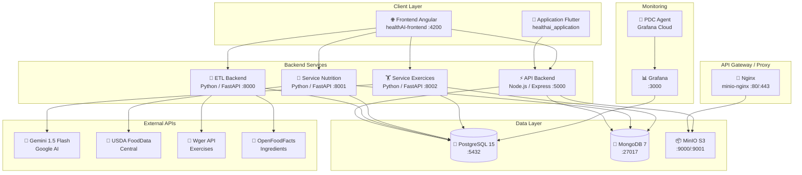
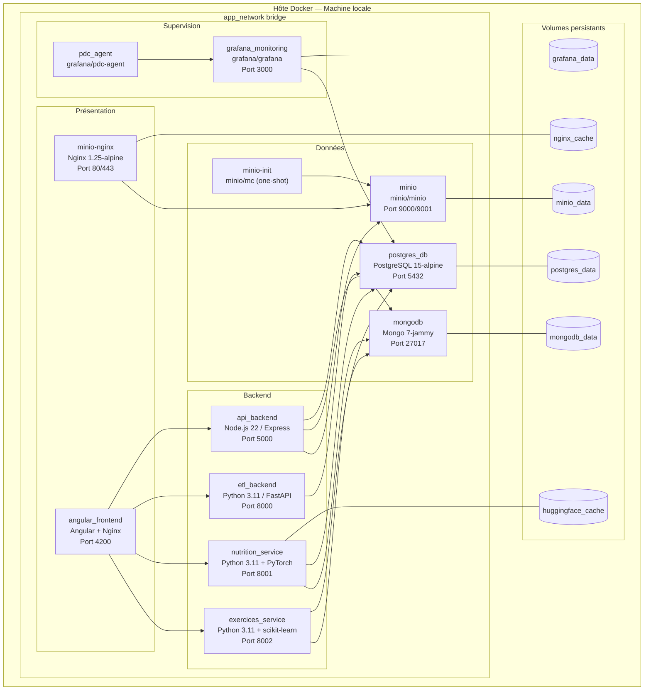
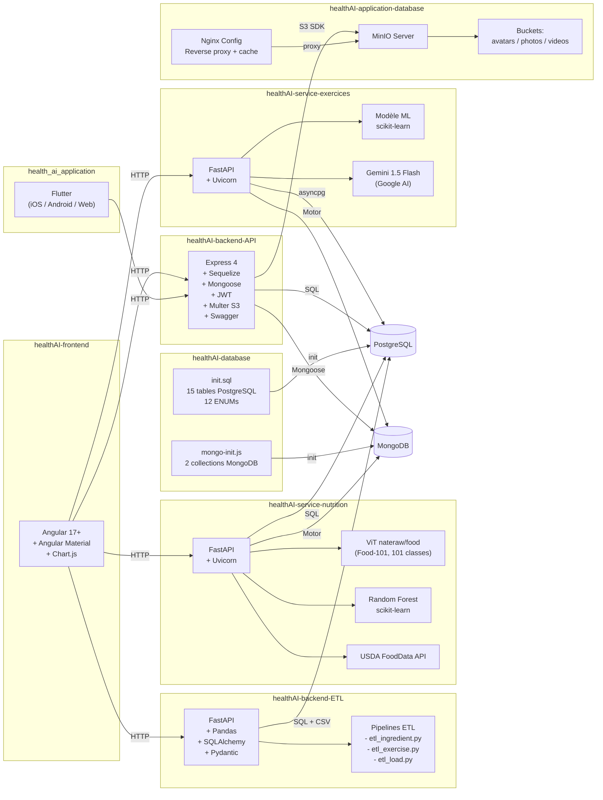
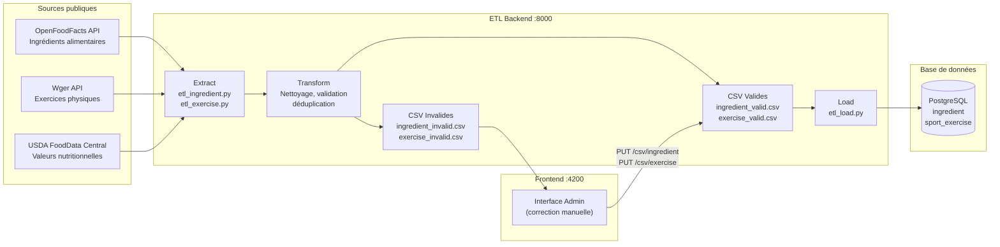
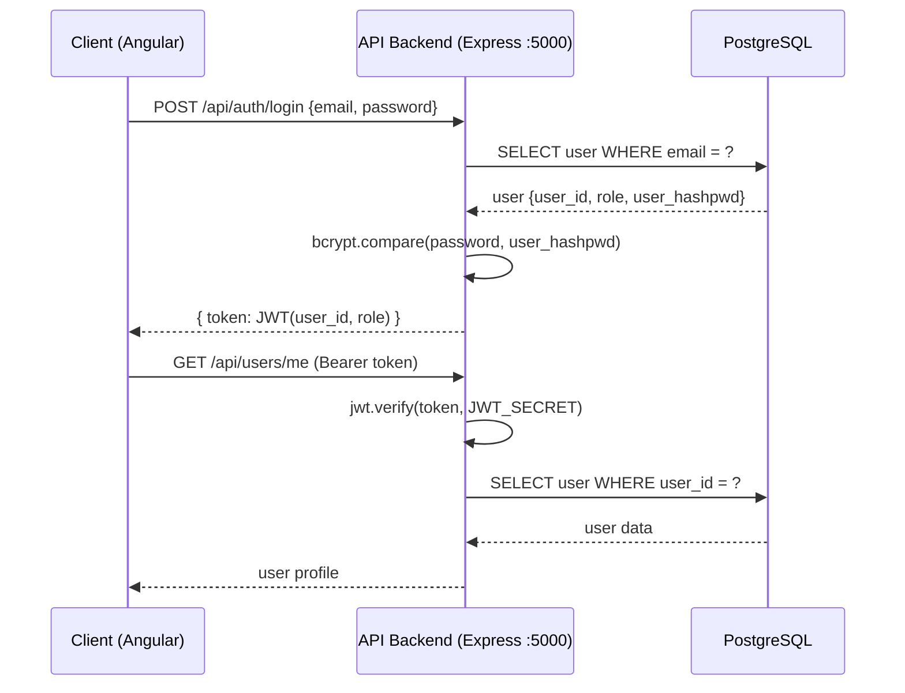
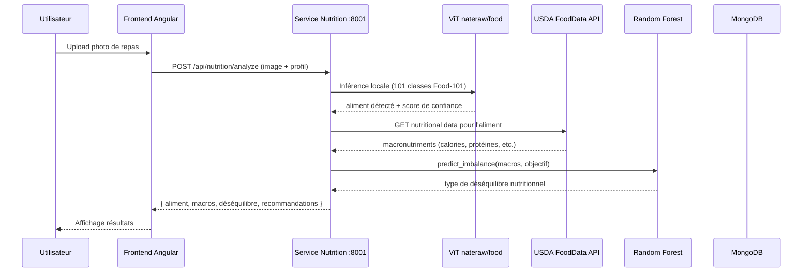
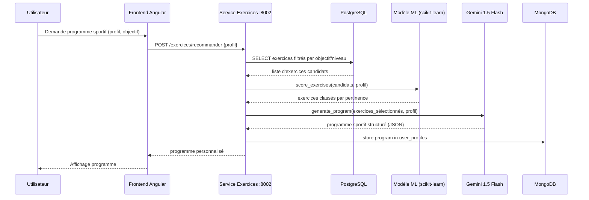

# 🏗️ Documentation de l'Architecture Système — HealthAI Coach

> **Projet** : HealthAI Coach — MSPR TPRE601  
> **Équipe** : Mathis Morales · Arnaud Goldberg · Hugo Lembrez · Mathilde Ageron  
> **Année** : 2025-2026 — EPSI, Certification CDA 3ème année

---

## Sommaire

1. [Présentation du projet](#1-présentation-du-projet)
2. [Architecture globale — Vue d'ensemble](#2-architecture-globale--vue-densemble)
3. [Diagramme de déploiement](#3-diagramme-de-déploiement)
4. [Diagramme de composants](#4-diagramme-de-composants)
5. [Schéma de la base de données relationnelle (PostgreSQL)](#5-schéma-de-la-base-de-données-relationnelle-postgresql)
6. [Modèle de données NoSQL (MongoDB)](#6-modèle-de-données-nosql-mongodb)
7. [Flux de données](#7-flux-de-données)
8. [Architecture des services IA](#8-architecture-des-services-ia)
9. [Architecture de stockage objet (MinIO)](#9-architecture-de-stockage-objet-minio)
10. [Architecture réseau](#10-architecture-réseau)
11. [Dépôts et organisation du code](#11-dépôts-et-organisation-du-code)
12. [Benchmarks technologiques](#12-benchmarks-technologiques)

---

## 1. Présentation du projet

**HealthAI Coach** est une application de coaching santé personnalisé développée en deux phases :

| Phase | Nom | Objectif |
|-------|-----|----------|
| **MSPR 1** | Collecte & Visualisation | Collecte, nettoyage, stockage et visualisation de données nutritionnelles et sportives depuis des APIs publiques. Exposition via API REST. Dashboards administrateurs. |
| **MSPR 2** | Intelligence & Personnalisation | Recommandations nutritionnelles et sportives via IA, interface utilisateur moderne conforme RGAA AA, micro-services spécialisés. |

### Périmètre fonctionnel

- **Gestion utilisateurs** : inscription, authentification JWT, profils santé (objectifs, régimes, allergies)
- **Données nutritionnelles** : ingrédients, recettes, valeurs nutritionnelles (source USDA/OpenFoodFacts)
- **Données sportives** : exercices, séances, programmes sportifs (source Wger)
- **IA Nutrition** : analyse photo de repas, calcul macronutriments, plan de repas hebdomadaire
- **IA Exercices** : recommandation personnalisée (ML + Gemini 1.5 Flash)
- **Suivi biométrique** : poids, pas quotidiens, sommeil
- **Social** : partage de photos/vidéos, fil social
- **Abonnements** : Freemium, Premium, Premium+, B2B entreprises
- **Administration** : dashboards, gestion ETL, supervision des données

---

## 2. Architecture globale — Vue d'ensemble

La solution repose sur une **architecture micro-services** orchestrée via Docker Compose.



---

## 3. Diagramme de déploiement



### Ports exposés sur l'hôte

| Port hôte | Conteneur | Service |
|-----------|-----------|---------|
| `80` | `nginx` | HTTP (MinIO proxy) |
| `443` | `nginx` | HTTPS (MinIO proxy) |
| `3000` | `grafana_monitoring` | Grafana UI |
| `4200` | `angular_frontend` | Frontend Web |
| `5000` | `api_backend` | API REST Node.js |
| `5432` | `postgres_db` | PostgreSQL |
| `8000` | `etl_backend` | API ETL |
| `8001` | `nutrition_service` | Service Nutrition |
| `8002` | `exercices_service` | Service Exercices |
| `9000` | `minio` | S3 API |
| `9001` | `minio` | Console MinIO |
| `27017` | `mongodb` | MongoDB |

---

## 4. Diagramme de composants



---

## 5. Schéma de la base de données relationnelle (PostgreSQL)

**15 tables**, **12 types ENUM**, normalisée en **3NF**.

### Diagramme entité-relation simplifié

```mermaid
erDiagram
    company {
        int company_id PK
        varchar company_name
        varchar company_email
        date company_inscription
    }

    subscription {
        int subscription_id PK
        decimal subscription_price
        enum subscription_name
        int company_id FK
        date subscription_company_end
    }

    authorization_ {
        int authorization_id PK
        enum authorization_type
    }

    subscription_authorization {
        int subscription_authorization_id PK
        int subscription_id FK
        int authorization_id FK
    }

    user_ {
        int user_id PK
        varchar user_username
        varchar user_firstname
        varchar user_lastname
        date user_birth
        enum user_role
        enum user_gender
        varchar user_city
        varchar user_country
        varchar user_phone
        int user_size
        decimal user_weight
        decimal user_last_weight
        varchar user_email
        varchar user_hashpwd
        date user_inscription
        int sport_program_id FK
        int company_id FK
    }

    user_health_profile {
        int users_health_profile_id PK
        enum user_health_profile_objective
        enum user_health_profile_activity
        enum user_health_profile_food_diet
        int user_id FK
    }

    user_allergy {
        int user_id FK
        enum allergy
    }

    user_biometric {
        int biometric_id PK
        date biometric_date
        int biometric_sleep
        int biometric_steps
        decimal biometric_weight
        int user_id FK
    }

    user_subscription {
        int user_subscription_id PK
        int user_id FK
        int subscription_id FK
        date user_subscription_start
        date user_subscription_end
        boolean user_subscription_is_active
    }

    session_progress {
        int session_progress_id PK
        date session_progress_start
        date session_progress_end
        int sport_session_id FK
        int user_id FK
        int sport_program_id FK
        int program_session_rank
    }

    sport_program {
        int sport_program_id PK
        varchar sport_program_name
        enum sport_program_objective
        int sport_program_sessions
        int sport_program_duration
        boolean sport_program_is_active
    }

    sport_session {
        int sport_session_id PK
        varchar sport_session_name
    }

    sport_exercise {
        int sport_exercise_id PK
        varchar sport_exercise_name
        enum sport_exercise_objective
        enum sport_exercise_difficulty
        int sport_exercise_duration
        enum sport_exercise_muscle_group
        varchar sport_exercise_video
        text sport_exercise_instruction
        int sport_exercise_cal_burned
    }

    sport_equipment {
        int sport_equipment_id PK
        varchar sport_equipment_name
    }

    recipe {
        int recipe_id PK
        varchar recipe_image
        varchar recipe_name
        text recipe_description
        text recipe_preparation
        enum recipe_type
    }

    ingredient {
        int ingredient_id PK
        varchar ingredient_name
        enum ingredient_type
        decimal ingredient_energy_100g
        decimal ingredient_protein_100g
        decimal ingredient_fiber_100g
        decimal ingredient_sugars_100g
        decimal ingredient_carbohydrate_100g
        decimal ingredient_salt_100g
        decimal ingredient_fats_100g
        decimal ingredient_saturated_fats_100g
    }

    ingredient_allergy {
        int ingredient_id FK
        enum allergy
    }

    consume {
        int consume_id PK
        int user_id FK
        int ingredient_id FK
        decimal ingredient_quantity
        date consume_date
    }

    recipe_ingredient {
        int recipe_ingredient_id PK
        int recipe_id FK
        int ingredient_id FK
        decimal ingredient_quantity
    }

    program_sport_session {
        int program_sport_session_id PK
        int sport_program_id FK
        int sport_session_id FK
        int program_sport_session_rank
    }

    sport_session_exercise {
        int sport_session_exercise_id PK
        int sport_session_id FK
        int sport_exercise_id FK
        int sport_session_exercise_rank
    }

    sport_exercise_equipment {
        int sport_exercise_equipment_id PK
        int sport_exercise_id FK
        int sport_equipment_id FK
    }

    company ||--o{ subscription : "a"
    company ||--o{ user_ : "emploie"
    subscription ||--o{ subscription_authorization : "a"
    authorization_ ||--o{ subscription_authorization : "accorde"
    user_ ||--o{ user_health_profile : "a"
    user_ ||--o{ user_allergy : "déclare"
    user_ ||--o{ user_biometric : "enregistre"
    user_ ||--o{ user_subscription : "souscrit"
    subscription ||--o{ user_subscription : "inclut"
    user_ ||--o{ session_progress : "progresse"
    user_ ||--o{ consume : "consomme"
    ingredient ||--o{ consume : "est consommé"
    ingredient ||--o{ ingredient_allergy : "contient"
    ingredient ||--o{ recipe_ingredient : "compose"
    recipe ||--o{ recipe_ingredient : "contient"
    sport_program ||--o{ program_sport_session : "organise"
    sport_session ||--o{ program_sport_session : "appartient"
    sport_session ||--o{ sport_session_exercise : "contient"
    sport_exercise ||--o{ sport_session_exercise : "fait partie"
    sport_exercise ||--o{ sport_exercise_equipment : "nécessite"
    sport_equipment ||--o{ sport_exercise_equipment : "utilisé par"
    sport_session ||--o{ session_progress : "suivi par"
    sport_program ||--o{ session_progress : "suivi par"
    sport_program ||--o{ user_ : "assigné à"
```



### Types ENUM définis

| ENUM | Valeurs |
|------|---------|
| `user_role_enum` | `admin`, `user`, `company_admin` |
| `gender_enum` | `male`, `female`, `other`, `prefer_not_to_say` |
| `objective_enum` | `weight_loss`, `muscle_gain`, `endurance`, `flexibility`, `maintenance` |
| `difficulty_enum` | `beginner`, `intermediate`, `advanced` |
| `recipe_type_enum` | `breakfast`, `lunch`, `dinner`, `snack`, `dessert`, `pleasure`, `muscle_gain`, `weight_loss` |
| `ingredient_type_enum` | `vegetable`, `fruit`, `meat`, `fish`, `dairy`, `grain`, `legume`, `other` |
| `allergy_enum` | `gluten`, `crustaceans`, `eggs`, `fish`, `peanuts`, `soybeans`, `milk`, `nuts`, `celery`, `mustard`, `sesame`, `sulphites`, `lupin`, `molluscs` |
| `food_diet_enum` | `vegan`, `vegetarian`, `pescatarian`, `gluten_free`, `lactose_free`, `halal`, `kosher`, `none` |
| `activity_level_enum` | `sedentary`, `lightly_active`, `moderately_active`, `very_active`, `extra_active` |
| `authorization_type_enum` | `Freemium`, `Premium`, `Premium+` |
| `subscription_name_enum` | `Freemium`, `Premium`, `Premium+`, `B2B` |
| `muscle_group_enum` | `chest`, `back`, `shoulders`, `biceps`, `triceps`, `forearms`, `abs`, `glutes`, `quadriceps`, `hamstrings`, `calves`, `full_body` |

### Bonnes pratiques appliquées

- **Normalisation 3NF** — aucune redondance de données
- **Intégrité référentielle** — clés étrangères avec contraintes
- **Sécurité** — mots de passe hashés avec bcrypt (`user_hashpwd`)
- **Unicité** — contraintes UNIQUE sur les identifiants métier (email, username, noms)
- **Extensibilité** — types ENUM pour les valeurs contrôlées, tables de liaison pour les many-to-many

---

## 6. Modèle de données NoSQL (MongoDB)

Base : `healthai_social` (port `27017`)

### Collections

| Collection | Index | Contenu |
|-----------|-------|---------|
| `social_posts` | `authorUserId` (ASC), `createdAt` (DESC) | Publications sociales (photos, vidéos partagées) |
| `user_profiles` | `userId` (UNIQUE) | Profils étendus, plans de repas générés, programmes sportifs personnalisés |

### Document type — `user_profiles`

```json
{
  "userId": 42,
  "generatedMealPlans": [
    {
      "generatedAt": "2026-06-25T14:00:00Z",
      "duration": 7,
      "plan": {
        "monday": {
          "breakfast": { "recipe": "Overnight Oats", "calories": 380 },
          "lunch": { "recipe": "Salade quinoa", "calories": 520 },
          "dinner": { "recipe": "Saumon vapeur", "calories": 640 },
          "snack": { "recipe": "Yaourt fruits rouges", "calories": 180 }
        }
      }
    }
  ],
  "generatedSportPrograms": [
    {
      "generatedAt": "2026-06-25T14:00:00Z",
      "objective": "muscle_gain",
      "program": "..."
    }
  ]
}
```

### Document type — `social_posts`

```json
{
  "authorUserId": 42,
  "content": "Mon repas post-entraînement 💪",
  "mediaUrl": "http://localhost/photos/meal_42.jpg",
  "createdAt": "2026-06-25T12:00:00Z",
  "likes": 12
}
```

---

## 7. Flux de données

### Flux ETL (MSPR 1 — Collecte de données)



### Flux d'authentification



### Flux d'analyse nutritionnelle (IA)



### Flux de recommandation sportive (IA + LLM)



---

## 8. Architecture des services IA

### Service Nutrition — Architecture interne

```
healthAI-service-nutrition/
├── app/
│   ├── main.py          # FastAPI app + CORS + routeurs
│   ├── config.py        # Configuration (env, DB URLs)
│   ├── db/              # Connexions PostgreSQL + MongoDB
│   ├── models/          # Modèles Pydantic (schémas de données)
│   ├── routes/
│   │   ├── nutrition.py   # POST /api/nutrition/analyze
│   │   └── meal_plan.py   # POST /api/meal-plan/generate
│   ├── services/        # Logique métier (ViT, USDA, RF, planification)
│   └── middleware/      # Authentification JWT
├── ml/                  # Entraînement Random Forest
├── requirements.txt
└── Dockerfile
```

**Modèle ViT** : `nateraw/food` (Hugging Face) — Vision Transformer entraîné sur Food-101  
**Modèle Random Forest** : entraîné sur les déséquilibres nutritionnels selon les macros et l'objectif utilisateur  
**Source nutritionnelle** : USDA FoodData Central (API REST, clé gratuite)

### Service Exercices — Architecture interne

```
healthAI-service-exercices/
├── app.py           # FastAPI app + lifespan (chargement modèle au démarrage)
├── state.py         # Cache global (exercices + équipements)
├── routers/
│   └── exercices.py # POST /exercices/entrainer + POST /exercices/recommander
├── services/
│   ├── user_profile.py  # Récupération données depuis PostgreSQL
│   └── modele.py        # Entraînement et inférence scikit-learn
├── db/
│   ├── mongo.py     # Connexion MongoDB (motor async)
├── models/          # Schémas Pydantic
├── requirements.txt
└── Dockerfile
```

**Démarrage** : le modèle est chargé automatiquement au démarrage du conteneur via `lifespan` FastAPI depuis les données PostgreSQL.  
**LLM** : Gemini 1.5 Flash via SDK Python (quota gratuit : 15 req/min, 1 500 req/jour).

---

## 9. Architecture de stockage objet (MinIO)

### Structure des buckets

```
MinIO (S3-compatible)
├── avatars/          ← Photos de profil (lecture publique anonyme)
│   └── user_{id}_avatar.jpg
├── photos/           ← Photos postées dans le fil social (lecture publique)
│   └── post_{id}_photo.jpg
└── videos/           ← Vidéos postées dans le fil social (lecture publique)
    └── post_{id}_video.mp4
```

### Flux d'upload

```
Client (Angular/Flutter)
    │
    ▼
API Backend (Express)
    │ multer-s3
    ▼
MinIO S3 API (:9000)
    │
    ▼
Nginx Cache (:80/443)
    │ Sert les fichiers aux clients
    ▼
Client (lecture publique)
```

### Politique d'accès

| Élément | Configuration |
|---------|--------------|
| Buckets publics | `avatars`, `photos`, `videos` — lecture anonyme (GET) |
| Compte applicatif | `APP_ACCESS_KEY` avec politique `social-app-policy` |
| Politique JSON | Permissions minimales : lecture/écriture sur les buckets applicatifs uniquement |

---

## 10. Architecture réseau

### Réseau Docker

```
app_network (bridge)
├── postgres_db      172.x.x.2
├── mongodb          172.x.x.3
├── api_backend      172.x.x.4
├── etl_backend      172.x.x.5
├── angular_frontend 172.x.x.6
├── nutrition_service 172.x.x.7
├── exercices_service 172.x.x.8
├── grafana_monitoring 172.x.x.9
├── pdc_agent        172.x.x.10
├── minio            172.x.x.11
├── minio-init       172.x.x.12 (éphémère)
└── minio-nginx      172.x.x.13
```

Tous les services communiquent par **nom de conteneur** au sein du réseau bridge. Seuls les ports listés sont exposés sur l'hôte.

### Reverse proxy Nginx (MinIO)

```nginx
# nginx.conf — MinIO reverse proxy avec cache
upstream minio_backend {
    server minio:9000;
}

server {
    listen 80;
    location / {
        proxy_pass http://minio_backend;
        proxy_cache nginx_cache;
        # Headers cache media
    }
}
```

---

## 11. Dépôts et organisation du code

### Organisation multi-repo

```
MSPR/ (dossier parent)
├── README.md                      ← README principal
├── README-docker.md               ← Documentation Docker
├── README-supervision.md          ← Documentation supervision
├── README-architecture.md         ← Ce fichier
├── docker-compose.yml             ← Stack principale
├── docker-compose.offline.yml     ← Mode hors-ligne
├── docker-compose.perf.yml        ← Mode basse RAM
├── .env                           ← Variables d'environnement
├── run.py                         ← Script de démarrage unifié
│
├── healthAI-config/               ← Configuration centralisée
│   ├── docker-compose*.yml
│   ├── GUIDE_COMPLET_HEALTHAI.md
│   └── git_pull_all.py
│
├── healthAI-frontend/             ← Interface Angular
│   ├── src/
│   ├── Dockerfile
│   └── angular.json
│
├── healthAI-backend-API/          ← API REST Node.js
│   ├── app.js
│   ├── controllers/
│   ├── models/
│   ├── routes/
│   ├── middleware/
│   └── Dockerfile
│
├── healthAI-backend-ETL/          ← Pipeline ETL Python
│   ├── api.py
│   ├── etl.py
│   ├── etl_ingredient.py
│   ├── etl_exercise.py
│   ├── etl_load.py
│   └── Dockerfile
│
├── healthAI-database/             ← Schémas de base de données
│   ├── init.sql                   ← PostgreSQL (15 tables)
│   └── mongo-init.js              ← MongoDB (2 collections)
│
├── healthAI-service-nutrition/    ← Service IA Nutrition
│   ├── app/
│   │   ├── main.py
│   │   ├── routes/
│   │   └── services/
│   ├── ml/
│   └── Dockerfile
│
├── healthAI-service-exercices/    ← Service IA Exercices
│   ├── app.py
│   ├── routers/
│   ├── services/
│   └── Dockerfile
│
├── healthAI-application-database/ ← MinIO Object Storage
│   ├── Dockerfile
│   ├── nginx/
│   ├── scripts/init-buckets.sh
│   └── policies/app-policy.json
│
├── healthAI-monitoring/           ← Configuration monitoring
│   └── (Grafana dashboards)
│
└── health_ai_application/         ← Application mobile Flutter
    ├── lib/
    ├── android/
    ├── ios/
    └── pubspec.yaml
```

### Tableau récapitulatif des dépôts

| Dépôt | Langage / Stack | Rôle | Dépendances |
|-------|----------------|------|-------------|
| `healthAI-config` | Python, YAML | Configuration, orchestration Docker | — |
| `healthAI-frontend` | TypeScript, Angular 17 | Interface web utilisateur et admin | API Backend, ETL, Nutrition, Exercices |
| `healthAI-backend-API` | JavaScript, Node.js, Express | API REST principale (auth, CRUD) | PostgreSQL, MongoDB, MinIO |
| `healthAI-backend-ETL` | Python, FastAPI | Pipeline ETL + validation données | PostgreSQL, APIs publiques |
| `healthAI-database` | SQL, JavaScript | Schémas PostgreSQL et MongoDB | — |
| `healthAI-service-nutrition` | Python, FastAPI, PyTorch | Recommandations nutritionnelles IA | PostgreSQL, MongoDB, USDA API |
| `healthAI-service-exercices` | Python, FastAPI, scikit-learn | Recommandations sportives IA | PostgreSQL, MongoDB, Gemini API |
| `healthAI-application-database` | Shell, Nginx | MinIO + reverse proxy médias | MinIO |
| `healthAI-monitoring` | — | Configuration Grafana | PostgreSQL, Grafana Cloud |
| `health_ai_application` | Dart, Flutter | Application mobile cross-platform | API Backend |

---

## 12. Benchmarks technologiques

### Frontend — Choix d'Angular

| Critère | React | Vue.js | **Angular ✅** |
|---------|-------|--------|--------------|
| Type | Librairie UI | Framework progressif | Framework complet |
| Langage | JS / TS | JS / TS | **TypeScript** |
| Architecture | Partielle | Moyenne | **Complète** |
| Routing / Forms / DI | Via librairies | Via librairies | **Inclus nativement** |
| Maintenabilité | Bonne | Bonne | **Très bonne** |
| Accessibilité RGAA | Via librairies | Via librairies | **Angular Material** |

> **Angular retenu** pour son architecture TypeScript complète, ses fonctionnalités natives et l'excellente intégration Angular Material pour la conformité RGAA AA.

### ETL — Choix de Pandas

Benchmark sur un CSV de 5M lignes (~800 Mo) :

| Opération | **Pandas ✅** | PySpark (local) | Node.js |
|-----------|------------|-----------------|---------|
| Lecture CSV | **8.7 s / 2.3 Go** | 22.4 s / 3.8 Go | 11.2 s / 0.9 Go |
| Groupby + join | **4.3 s** | 18.2 s | 38.5 s |
| Écriture Parquet | **1.6 s** | 4.2 s | Non natif |
| Écriture PostgreSQL | 9.1 s | 18.5 s | **7.3 s** |

> **Pandas retenu** : compatible SQLAlchemy et FastAPI, backend Apache Arrow, volumes < 5 Go dans sa zone de confort.

### API Framework — FastAPI vs Flask vs Express

Benchmark wrk (10s, 100 connexions concurrentes) :

| Framework | Req/s | Latence moy. | Latence p99 |
|-----------|-------|-------------|-------------|
| **Express ✅** | **14 100** | **7 ms** | **18 ms** |
| **FastAPI ✅** | 12 400 | 8 ms | 21 ms |
| Flask | 3 200 | 31 ms | 74 ms |

> **Express** retenu pour l'API principale (légèreté, async non bloquant).  
> **FastAPI** retenu pour les services Python (validation Pydantic, Swagger natif, async).

### LLM — Choix de Gemini 1.5 Flash

| LLM | Req/min | Req/jour | Tokens/min | Coût |
|-----|---------|----------|------------|------|
| **Gemini 1.5 Flash ✅** | **15** | **1 500** | **1 000 000** | **$0.075/1M tok** |
| Claude 3 Haiku | — | — | — | $0.25/1M tok |
| Mistral Small | 1 | 500 | 2 000 | €0.10/1M tok |

> **Gemini 1.5 Flash retenu** : seul LLM avec un tier gratuit suffisant pour le développement, SDK Python officiel, latence très faible.

### Runtime ML — Choix de Python

Inférence sur 10 000 prédictions :

| Runtime | Temps total | Temps/prédiction | RAM |
|---------|-------------|-----------------|-----|
| **Python ✅** | **0.31 s** | **0.031 ms** | **180 Mo** |
| Node.js | 1.84 s | 0.184 ms | 310 Mo |

> **Python retenu** : écosystème ML sans équivalent (scikit-learn, PyTorch, Hugging Face), inférence 6× plus rapide que Node.js.
